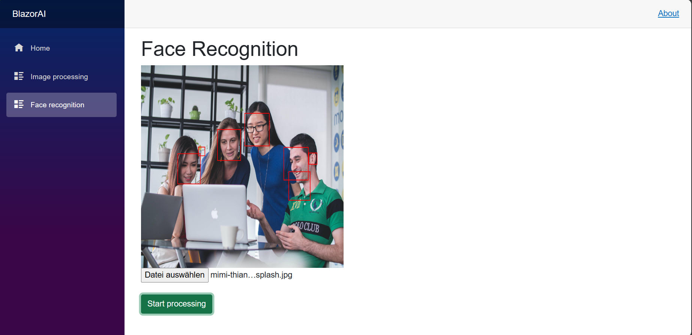

Blazor AI

Blazor AI is an application that empowers users to upload images, extract relevant information, and detect faces. It utilizes the **Emgu.CV** library and the **Clarifai API**.




## Tools
* Blazor server
* Emgu.CV
* ClarifaiApi
## Setup
1. Clone the the source code:
```
$> Git clone https://github.com/iliass-de/blazor-ai.git
```
2. For image processing, you’ll need a free account at Clarifai and generate an API token. If you don’t have one, you can still use the face recognition service.
3. Add your API token to the appsettings.json file.
4. Run the application:
```
$> Dotnet run
```
