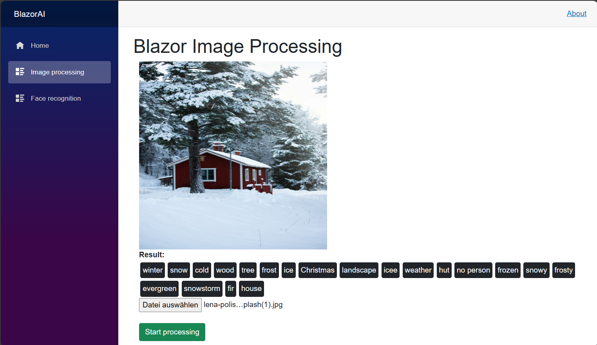

Blazor AI

Simple Blazor application that allows users to upload images and extract relevant information using the **ClarifaiApi**.  



## Tools
* Blazor server
* ClarifaiApi
## Setup
1. Clone the the source code:
```
$> Git clone https://github.com/iliass-de/blazor-ai.git
```
2. Create an account for free at https://www.clarifai.com/ and generate an API_Token
3. Add the API_Token to the appsettings.json file
4. Run the application:
```
$> Dotnet run
```
